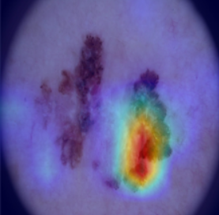
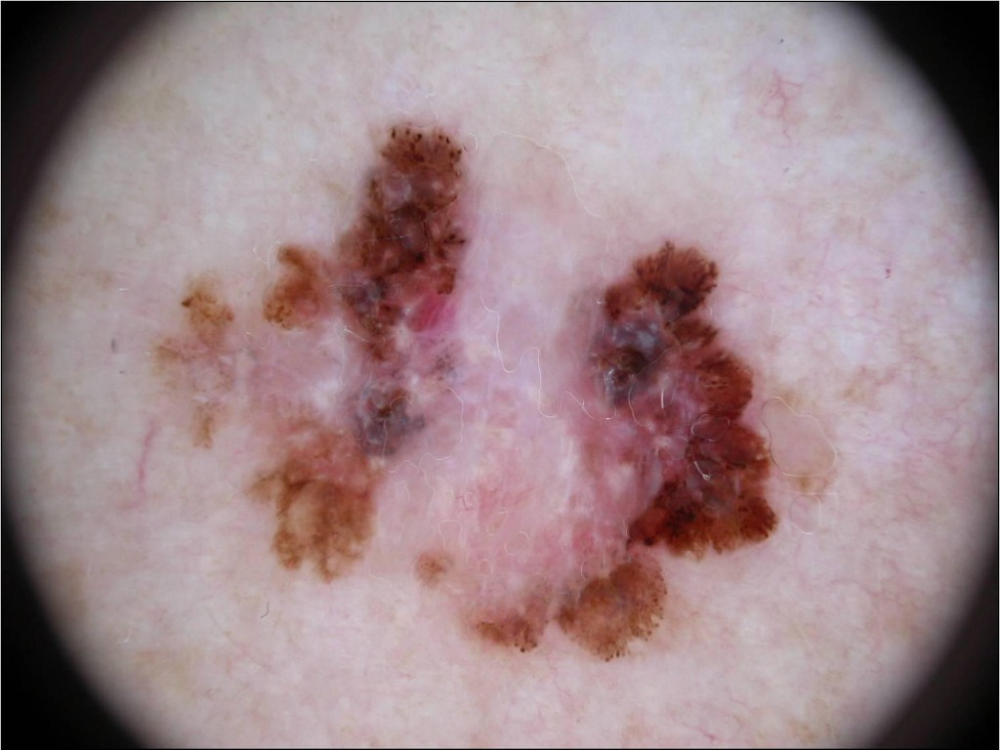

<p align="center">
  
</p>

<h1 align="center">🔬 Skin Cancer Detection API</h1>

<p align="center">
  <b>Deep Learning-powered dermoscopic image classification with explainable AI</b>
</p>

<p align="center">
  
  
  
  
  
  
</p>

---

## 📋 Overview

A production-ready REST API for **skin cancer classification** from dermoscopic images. The system leverages an **EfficientNetV2S** model fine-tuned on the **HAM10000** dataset to classify skin lesions into **7 diagnostic categories**, each tagged with a clinical risk level. Every prediction is accompanied by a **Grad-CAM heatmap** that highlights the regions of the image most influential to the model's decision — making the system interpretable and clinically transparent.

<br/>

<p align="center">
  
  &nbsp;&nbsp;&nbsp;&nbsp;
  
</p>

<p align="center">
  <i>Left: Dermoscopic input image &nbsp;|&nbsp; Right: Grad-CAM heatmap overlay highlighting the model's area of focus</i>
</p>

---

## 🧠 Model Details

| Attribute | Details |
|---|---|
| **Architecture** | EfficientNetV2S |
| **Source** | [Miguel764/efficientnetv2s-skin-cancer-classifier](https://huggingface.co/Miguel764/efficientnetv2s-skin-cancer-classifier) (HuggingFace) |
| **Training Dataset** | [HAM10000](https://dataverse.harvard.edu/dataset.xhtml?persistentId=doi:10.7910/DVN/DBW86T) — 10,015 dermoscopic images |
| **Input Size** | 224 × 224 px (RGB) |
| **Output** | 7-class softmax probability distribution |
| **Explainability** | Grad-CAM via TensorFlow `GradientTape` |

---

## 🏷️ Supported Classes

| # | Class | Abbreviation | Risk Level |
|---|---|---|---|
| 0 | Actinic Keratosis | `akiec` | 🟠 Pre-cancerous |
| 1 | Basal Cell Carcinoma | `bcc` | 🔴 Malignant |
| 2 | Benign Keratosis | `bkl` | 🟢 Benign |
| 3 | Dermatofibroma | `df` | 🟢 Benign |
| 4 | Melanoma | `mel` | 🔴 Malignant |
| 5 | Melanocytic Nevi | `nv` | 🟢 Benign |
| 6 | Vascular Lesion | `vasc` | 🟢 Benign |

---

## ⚙️ Tech Stack

- **Backend Framework** — [FastAPI](https://fastapi.tiangolo.com/) + [Uvicorn](https://www.uvicorn.org/)
- **Deep Learning** — [TensorFlow](https://www.tensorflow.org/) / Keras
- **Explainability** — Grad-CAM (Gradient-weighted Class Activation Mapping)
- **Image Processing** — [OpenCV](https://opencv.org/) + [Pillow](https://pillow.readthedocs.io/)

---

## 🚀 Getting Started

### Prerequisites

- **Python 3.11** (required)
- Model weights file (`efficientnetv2s.h5`)

### 1. Clone the Repository

```bash
git clone https://github.com/AryanBoro/skin-cancer-detection.git
cd skin-cancer-detection
```

### 2. Create a Virtual Environment

```bash
python -m venv venv
source venv/bin/activate        # Linux / macOS
venv\Scripts\activate           # Windows
```

### 3. Install Dependencies

```bash
pip install -r requirements.txt
```

### 4. Download the Model

Download the pre-trained model from HuggingFace:

📦 [Miguel764/efficientnetv2s-skin-cancer-classifier](https://huggingface.co/Miguel764/efficientnetv2s-skin-cancer-classifier)

Place the `efficientnetv2s.h5` file in the project root directory, then update the `MODEL_PATH` in `main.py` to point to the model file:

```python
MODEL_PATH = "efficientnetv2s.h5"
```

### 5. Run the Server

```bash
uvicorn main:app --host 0.0.0.0 --port 8000 --reload
```

The API will be live at **http://localhost:8000**

Interactive docs available at **http://localhost:8000/docs** (Swagger UI)

---

## 📡 API Endpoints

### `GET /`

Health check endpoint.

**Response:**
```json
{
  "message": "Skin Cancer Detection API is running"
}
```

### `POST /predict`

Classify a dermoscopic image and return predictions with a Grad-CAM heatmap.

**Request:**
- **Content-Type:** `multipart/form-data`
- **Body:** `file` — an image file (JPEG, PNG, etc.)

```bash
curl -X POST "http://localhost:8000/predict" \
  -F "file=@skin_lesion.jpg"
```

**Response:**
```json
{
  "prediction": "Melanoma (mel)",
  "confidence": 87.34,
  "risk_level": "Malignant",
  "all_classes": [
    {
      "class": "Melanoma (mel)",
      "confidence": 87.34,
      "risk": "Malignant"
    },
    {
      "class": "Basal Cell Carcinoma (bcc)",
      "confidence": 6.21,
      "risk": "Malignant"
    },
    {
      "class": "Benign Keratosis (bkl)",
      "confidence": 3.45,
      "risk": "Benign"
    }
  ],
  "gradcam": "<base64-encoded-PNG-image>"
}
```

| Field | Type | Description |
|---|---|---|
| `prediction` | `string` | Top predicted class name |
| `confidence` | `float` | Confidence score (0–100%) |
| `risk_level` | `string` | Clinical risk: `Benign`, `Pre-cancerous`, or `Malignant` |
| `all_classes` | `array` | All 7 classes with individual confidence scores, sorted descending |
| `gradcam` | `string` | Base64-encoded PNG of the Grad-CAM heatmap overlay |

---

## 🔍 Grad-CAM Explainability

The API generates a **Grad-CAM (Gradient-weighted Class Activation Mapping)** heatmap for every prediction. This technique uses the gradients flowing into the final convolutional layer to produce a coarse localization map highlighting the important regions in the image that influenced the model's decision.

<p align="center">
  
</p>

**How it works:**
1. A forward pass is made through the model using `tf.GradientTape`
2. Gradients of the predicted class are computed with respect to the last Conv2D layer
3. Gradients are global-average-pooled to obtain channel importance weights
4. A weighted combination of feature maps produces the heatmap
5. The heatmap is resized, color-mapped (JET), and overlaid on the original image

---

## 📁 Project Structure

```
skin-cancer-detection/
├── main.py              # FastAPI application with prediction & Grad-CAM logic
├── requirements.txt     # Python dependencies
├── efficientnetv2s.h5   # Pre-trained model weights (download separately)
├── assets/
│   ├── gradcam_heatmap.png
│   └── dermoscopic_sample.jpg
├── .gitignore
└── README.md
```

---

## ⚠️ Disclaimer

> **This tool is intended for educational and research purposes only.** It is **not** a substitute for professional medical diagnosis. Always consult a qualified dermatologist or healthcare provider for clinical decisions. The model's predictions should be used as a supplementary aid, not as a definitive diagnosis.

---

## 📜 License

This project is open source and available under the [MIT License](LICENSE).

---

## 🙏 Acknowledgements

- **HAM10000 Dataset** — Tschandl, P., Rosendahl, C. & Kittler, H. *The HAM10000 dataset, a large collection of multi-source dermatoscopic images of common pigmented skin lesions.* Sci. Data 5, 180161 (2018).
- **Model** — [Miguel764/efficientnetv2s-skin-cancer-classifier](https://huggingface.co/Miguel764/efficientnetv2s-skin-cancer-classifier) on HuggingFace
- **Grad-CAM** — Selvaraju, R.R. et al. *Grad-CAM: Visual Explanations from Deep Networks via Gradient-based Localization.* ICCV 2017.
